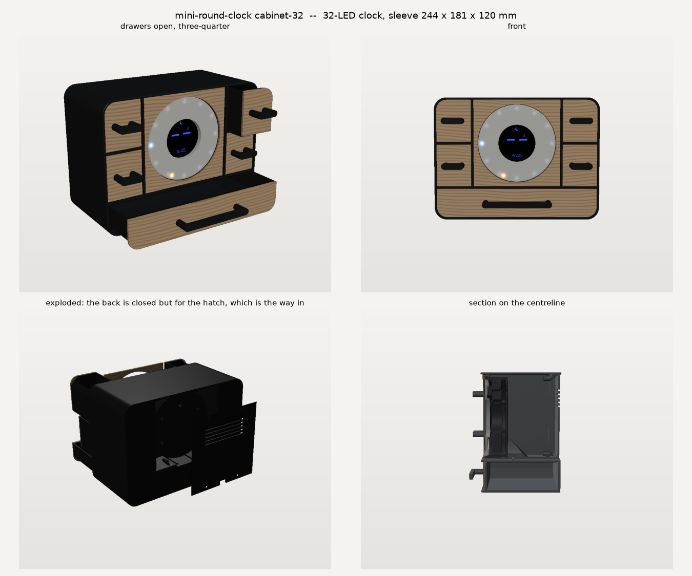

# The cabinet: clock on top, drawer underneath

A desk box in the style of the reference drawer units: a black printed sleeve
with 18 mm corners, flush plywood fronts set 1 mm back with a 0.8 mm reveal,
and slim black bar pulls. The round clock sits in the middle of the top row
behind a plywood face with a round window, with **two stacked drawers either
side of it**, and a full-width drawer runs underneath. Five drawers in all.



```
python cabinet.py            # STLs (stl/, 3mf/), world-frame meshes (cabinet/world/), SVGs
python check13_cabinet.py    # 412 checks on both bodies, measured on the meshes
python render_cabinet.py     # these pictures
```

Every dimension is in `params.py` under **THE CABINET**. The width is
`CAB_ASPECT` × the height (1.25, landscape like the references); set it to 0
for the narrowest box the clock allows.

| body | sleeve W × H × D | bottom drawer inside | each side drawer inside | plastic |
|---|---|---|---|---|
| 24 LED (108 mm clock) | 228.4 × 169.2 (+1.6 feet) × 120 | 219 × 107 × 42 | 46 × 107 × 56 | 763 cm³, ~970 g |
| 32 LED (120 mm clock) | 244.4 × 181.0 (+1.6 feet) × 120 | 235 × 107 × 42 | 48 × 107 × 62 | 837 cm³, ~1060 g |
| 60 LED (240 mm clock) | 407 wide: **not built**, it does not fit a 256 mm bed | | | |

`CAB_SIDE_ROWS` sets how many drawers stack in each side bay (2). Set it to 1
for one tall drawer a side; go higher and it stops when a row would fall under
`CAB_SIDE_ROW_MIN` (25 mm), and says which it built.

**That is a 1 kg spool.** The sleeve is the big part; the three drawers
are thin-walled and light for their size. If that is too much, drop
`CAB_ASPECT` to 1.0: under `CAB_SIDE_MIN` of side bay the box goes back to one
wide clock bay, no partitions and no side drawers, and the whole thing is about
450 g.

The side drawers exist because the clock is round and its bay was a rectangle:
the space either side of the dial was dead. Two partitions turn it into a
drawer each side, and the centre bay narrows to the clock's own square.

## The back is closed, except for one hatch

The sleeve's own back wall closes every drawer bay -- that is what the drawers
shut against, and there is no panel to take off to get at them. Only the
clock's bay is open at the back, and a **hatch** closes it, sitting 2 mm inside
the back face in a tapered rebate. Take out four screws and the clock, its
leads and the ESP32-S3 are all right there.

**This is why the sleeve prints back face down.** With the back closed, printing
it front down would put a 2.4 mm roof over every bay -- 219 × 107 mm of bridge
over the bottom drawer alone. Back down, that wall is the first layer.

The hatch is a plug, not a plate: its edge is chamfered to match the rebate, so
it centres itself and cannot fall through. A straight-edged plate small enough
to pass the rebate's narrow end has nothing to land on, which check13 caught
before anything was printed.

## The clock does not change

It goes in as the parts already printed for the stand-box: **base + flange
diffuser + back cover**. Use the **flange** diffuser (`-diffuser-flange` or
`-flange-plain`): the window is cut to the base's lip, so the flange is what
fills it edge to edge.

## Print these (black PETG)

| File | Orientation | Notes |
|---|---|---|
| `mini-round-clock-cabinet{,-32}-sleeve` | **back face down** | The whole box, closed back included. No supports; the widest overhang is 3.1 mm. |
| `mini-round-clock-cabinet{,-32}-hatch` | outside face down | The one removable panel. Countersinks open to the bed. |
| `mini-round-clock-cabinet{,-32}-drawer` | **open side up** | Bottom corners are 46° chords, not rounds, so it prints. |
| `mini-round-clock-cabinet{,-32}-drawer-side-r1`, `-r2` | **open side up** | The right side's lower and upper drawers. |
| `mini-round-clock-cabinet{,-32}-drawer-side-l1`, `-l2` | **open side up** | The left side's. Left and right are mirror images and all four are emitted, so there is nothing to flip in the slicer. |
| `mini-round-clock-cabinet{,-32}-pull` | grip face down | Pilots open upward. |
| `mini-round-clock-cabinet{,-32}-pull-side` | grip face down | **Print four** — the same bar serves every side drawer. |

## Laser this (3 mm ply, Glowforge)

`mini-round-clock-cabinet{,-32}-fronts.svg`: all six fronts on one sheet — the
four side fronts, the clock's face panel and the bottom drawer front — **laid
out exactly as they sit on the box**, so the grain runs on from one front to
the next. Red = cut. Cut the holes first and the outlines last.

Only the top row's fronts are handed (round in the corner they share with the
sleeve, square elsewhere); the lower ones are plain rectangles. Every front is
drawn where it belongs, so there is nothing to work out at the laser.

**Measure the sheet first.** `PLY_T` = 3.00 sets how far back the clock sits.
It is the same constant the 60's laser-cut face uses -- one sheet, one number --
so if yours is not 3.00, set `PLY_T` once in params.py and rebuild both.

## Buy

- 4 × M3 × 30 countersunk self-tapping screws (the hatch; its bosses start
  23 mm in, behind the cone that carries them)
- 10 × M3 × 12 pan-head self-tapping screws (the five pulls, two each, from
  inside their drawers)
- 1 mm double-sided foam tape: one strip under the ESP32-S3, and six small
  squares on the face-panel stop tabs
- 2 × 10 mm self-adhesive rubber bumpers, optional, if the feet slide

## Assembly

1. **Face panel in from the front.** Put tape squares on the six stop tabs
   and press the ply panel in until it lands on them. Its face ends up 1 mm
   behind the sleeve.
2. **Clock in through the hatch opening, flat.** It will not go in lifted --
   the rebate takes 2.5 mm off the top of the opening -- so slide it in flat
   until it is past the lip's ramp, about 60 mm in, THEN lift it 2.5 mm, carry
   on until the face touches the panel, and let it drop onto the saddle. Leads
   out of the back cover's 6 o'clock notch, straight down; the saddle and the
   lip are both cut away over the board's lane for them.
3. **S3 in from the back**, component side up, USB end last, along the rails
   until it meets the end stop. Tape underneath. Solder or plug the leads.
4. **Hatch straight in.** It wedges into the rebate's taper and lands 1.55 mm
   inside the back face. Then 4 × M3 × 30. The USB-C window lines up with the
   socket.
5. **Drawers, all five the same way.** Glue or tape the ply front to the
   drawer box, then fit its pull with 2 × M3 × 12 from inside, through the box
   and the ply into the pull's legs. Slide it in. The bottom drawer stops on
   the sleeve's own back wall, and so does each side drawer. Nothing stops
   against the hatch.

## Verified by check13 (measured, not assumed)

- Every part is one closed solid, fits the bed as printed, and overlaps no
  other part.
- The real clock parts, placed: they touch nothing. The clock **rests** on the
  saddle (0.10 mm lower is in plastic). Nothing of it reaches in front of the
  panel. The whole flange diffuser is inside the window, and the wood covers
  the base's rim.
- **Assembly journeys, stepped against the mesh:** the clock goes in flat from
  outside the box, lifts 2.51 mm once it is behind the lip's ramp, and carries
  on to its seat before dropping. Seated, it can move neither back (lip) nor
  forward (panel). The board slides in along its rails. The hatch goes straight
  into its rebate. Every drawer slides fully out. A 12 mm lead lane runs from
  the notch to the board.
- **The back really is closed:** every drawer bay is 100% solid behind it, the
  clock bay is open the full size of the hatch, and the clock passes through
  that opening flat (113 × 113 against a 108 mm clock on the 24).
- The hatch is recessed 2.0 mm, wedges into its taper 0.45 mm in, and each of
  its four screws crosses 23 mm of clear air into a 10 mm pilot with solid
  plastic all round.
- Drawer play, all five: 0.50 mm sideways and 0.80 mm up, corners included.
  Each slides fully out without touching anything but its own floor, and each
  stops where it should.
- Both partitions and both shelves are solid, measured through the mesh, and
  no screw boss reaches into a side bay — all four are in the centre bay's
  corners.
- Every front on the laser sheet is matched one for one against the ply part it
  is meant to be, and the sheet carries nothing else.
- Every front is in the same plane with the same 0.8 mm reveal on all four
  sides.
- The pull screws run clear through ply and drawer front, into 9 mm pilots
  with solid plastic all round. The back-panel screws run into pilots on the
  same axis. A full-size USB-C overmould (12.35 × 6.50) reaches the socket.
- The SVG outlines are the ply parts plus kerf, the window is the clock's
  aperture minus kerf, and the pull holes are at the pull's pitch.

## Not verified

- **Nothing has been printed or cut.** The pictures are renders.
- The board model is a 64 × 30 × 14 mm block with a 1.6 mm PCB, and the USB-C
  socket is assumed to sit on top of the PCB, centred at 1.6 mm above it.
  Check it on the bench before the back panel goes on.
- The face panel is held by tape on the stop tabs. Nothing pulls on it in use,
  but it is not captured.
- There is no drawer pull-out stop: the drawer comes all the way out.
